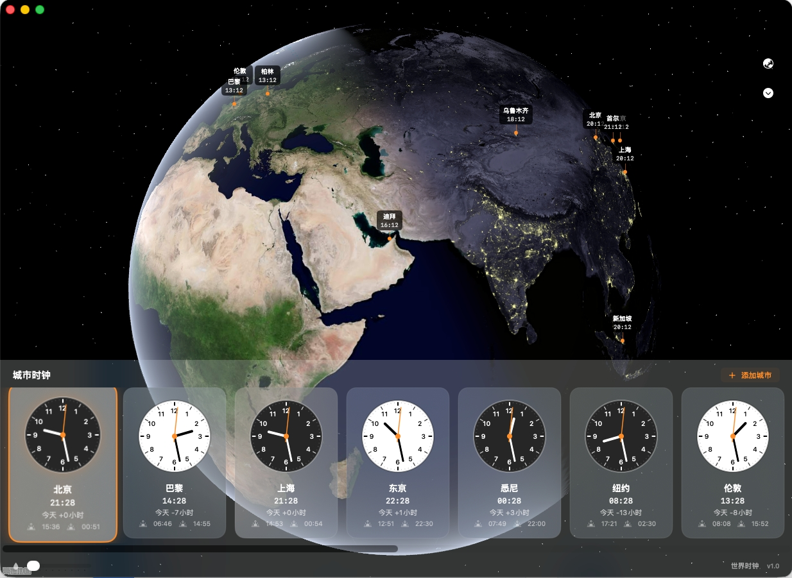

这是一款使用 SwiftUI 开发的简单世界时钟应用。

## 📸 应用截图

    

## ✨ 功能特点
- [x] 显示全球主要城市的时间
- [x] 支持 24 小时制切换
- [ ] 待办：添加桌面小组件 (Widget)

## 🛠 开发环境
- **Xcode**: 26.2
- **MacOs**: 14.6+
- **Language**: Swift

## 🚀 如何运行
1. 克隆项目到本地
2. 在 Xcode 中打开 `MacClock.xcodeproj`
3. 点击 `Run` 按钮即可在模拟器运行

## 📝 许可证
完全免费,注明出即可!
MIT License